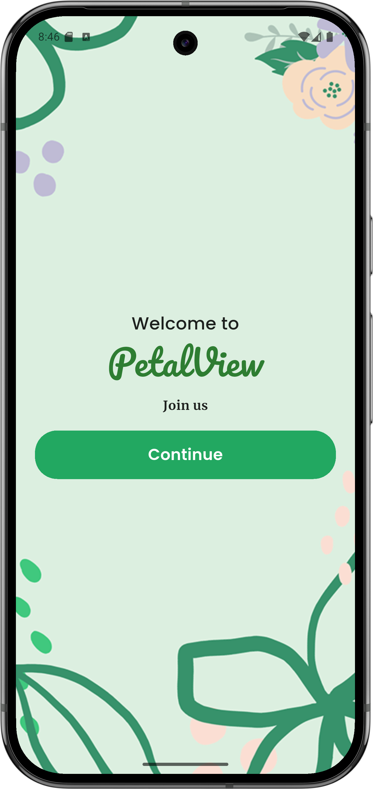
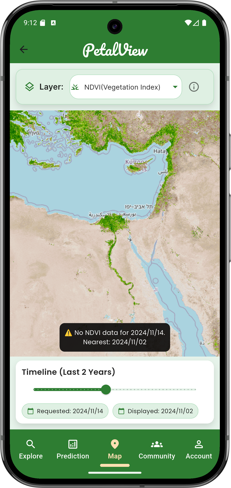
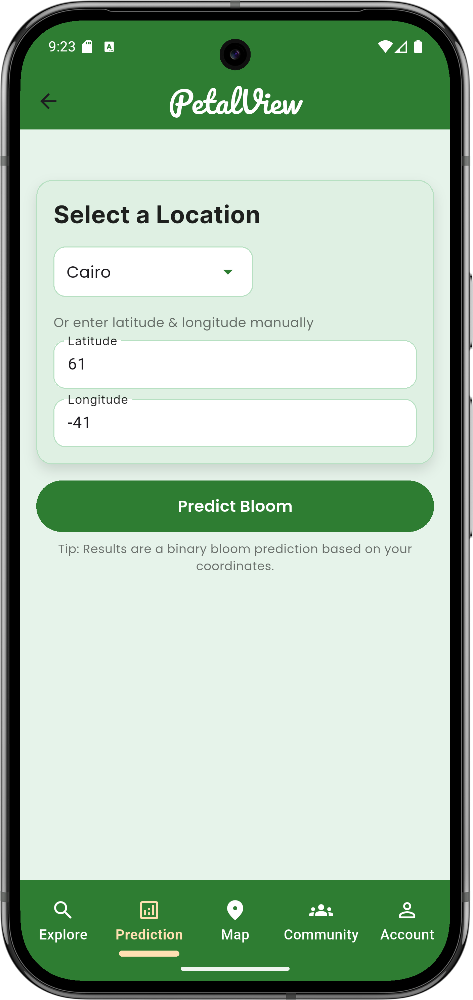
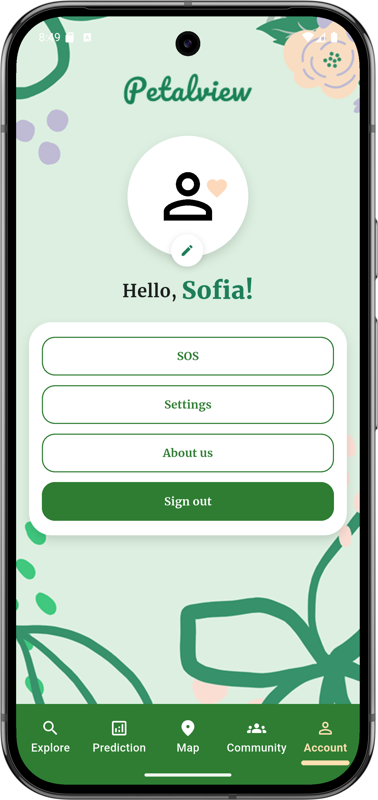
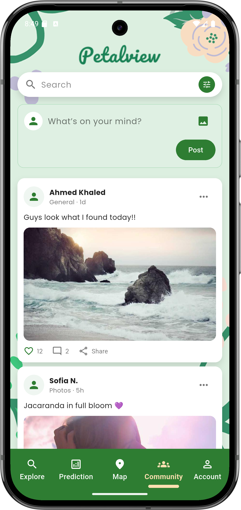

# 🌸 PetalView App

PetalView is a Flutter-based application for exploring, predicting, and
visualizing plant bloom data using NASA satellite layers and local
datasets.

------------------------------------------------------------------------

## 🚀 Features

-   Explore wildflower datasets
-   Interactive community feed
-   NASA Map Layers (NDVI & EVI)
-   Bloom prediction using ML API
-   Themed UI with search & filters

------------------------------------------------------------------------

## 📸 Screenshots

  ---------------------------------------------------------------------------------------------------
<p align="center">
  
  
  
  
  

  ---------------------------------------------------------------------------------------------------

------------------------------------------------------------------------

## 🎥 Demo

-   Watch the app demo:\
    [▶️ Screen Recording](assets/screenshot/demo.mp4)

------------------------------------------------------------------------

## 📄 PDF Report / Documentation

You can **view or download** the full PDF documentation here:

👉 [📥 Download Demo PDF](screenshots/demo.pdf)

Or click the preview image below:

[](assets/screenshot/PetalView Documentation .pdf)

------------------------------------------------------------------------

## 🛠️ Tech Stack

-   Flutter & Dart
-   Google Fonts & Shared Preferences
-   NASA Earthdata (GIBS API)
-   Flask ML Prediction API

------------------------------------------------------------------------

## 📦 Installation

``` bash
git clone https://github.com/your-username/petalview.git
cd petalview
flutter pub get
flutter run

---

## 🙏 Acknowledgements

Special thanks to Route team for providing the learning opportunity.

---

## 📬 Contact

**Fager Hussein Ahmed**  
📧 fagerhu03@gmail.com  
🔗 [LinkedIn](https://www.linkedin.com/in/fagerhu/)  
💻 [GitHub](https://github.com/fagerhu03)
