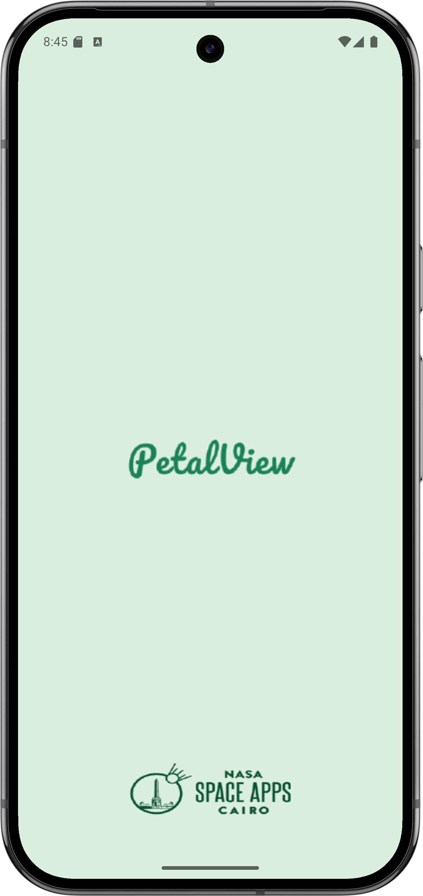
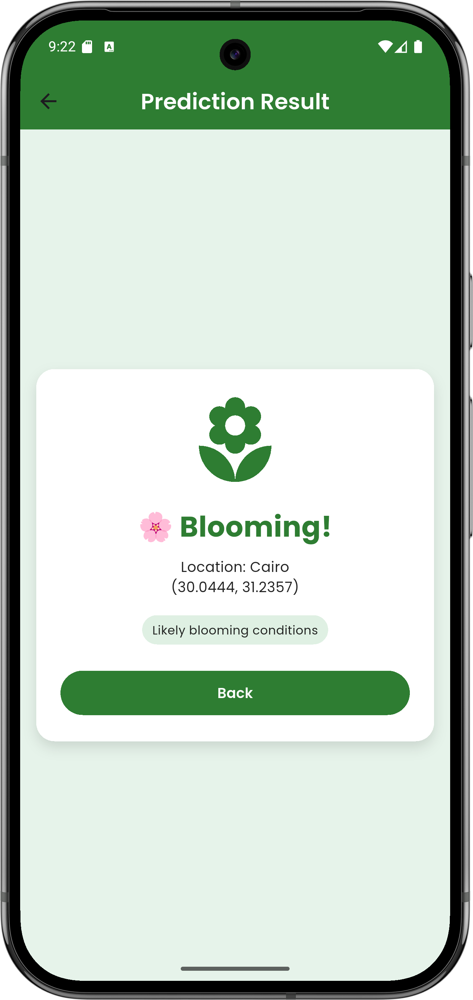
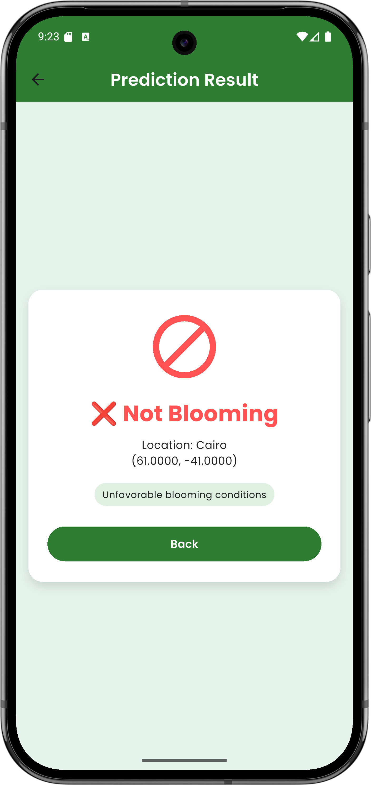

# 🌸 PetalView App

PetalView is a **Flutter-based space app** that combines AI prediction, remote sensing, and a vibrant community to monitor and predict wildflower blooming using NASA satellite data and local observations.

---

## 🚀 Key Features

- 🌿 **Explore Wildflower Datasets** – Browse and search through thousands of native species  
- 🧠 **AI Bloom Prediction** – Predict blooming probability using latitude & longitude  
- 🗺️ **NASA Map Layers** – Visualize NDVI & EVI data from NASA GIBS API  
- 💬 **Community Interaction** – Share plant posts, comment, and explore user stories  
- 👤 **Account Management** – Edit profile, manage preferences, and settings  
- 🪷 **Elegant Design** – Nature-inspired, mint-green theme and consistent UI across all screens  

---

## 🧭 App Flow Overview

| Step | Screen | Description |
|------|---------|-------------|
| 1️⃣ | **Splash Screen** | Displays the PetalView logo and smooth animation before app loads |
| 2️⃣ | **Introduction / Onboarding** | Quick overview of the app’s purpose and features |
| 3️⃣ | **Login / Signup** | Authentication flow for existing and new users |
| 4️⃣ | **Home Tabs** | Central navigation area linking to Explore, Map, Prediction, Community, and Account |
| 5️⃣ | **Explore Screen** | Search dataset using plant names, locations, or keywords |
| 6️⃣ | **Prediction Screen** | Enter coordinates or select city to predict flower bloom probability |
| 7️⃣ | **Map Screen** | Interactive NASA vegetation map with timeline and layers |
| 8️⃣ | **Community Screen** | User-generated posts, shared images, and feedback section |
| 9️⃣ | **Account Screen** | Shows user profile info, settings, and “About Us” section |

---


## 📸 Screenshots

<p align="center">
  <table>
    <tr>
      <td align="center">
        <br/>
        <b>Splash Screen</b><br/>
        Intro screen with app logo and animation
      </td>
      <td align="center">
        <br/>
        <b>Welcome</b><br/>
        Soft welcome layout introducing PetalView
      </td>
      <td align="center">
        <br/>
        <b>Login</b><br/>
        Secure login interface
      </td>
      <td align="center">
        <br/>
        <b>Signup</b><br/>
        Register new users
      </td>
    </tr>
    <tr>
      <td align="center">
        <br/>
        <b>Explore</b><br/>
        Search and view wildflower dataset
      </td>
      <td align="center">
        <br/>
        <b>Map</b><br/>
        Displays NASA GIBS NDVI & EVI layers
      </td>
      <td align="center">
        <br/>
        <b>Prediction</b><br/>
        Predict bloom likelihood using AI
      </td>
      <td align="center">
        <br/>
        <b>Community</b><br/>
        User-generated feed with posts & images
      </td>
    </tr>
    <tr>
      <td align="center">
        <br/>
        <b>Account</b><br/>
        Profile page & app settings
      </td>
      <td align="center">
        <br/>
        <b>Blooming Result</b><br/>
        Shows a positive bloom result
      </td>
      <td align="center">
        <br/>
        <b>Not Blooming Result</b><br/>
        Shows non-blooming prediction
      </td>
    </tr>
  </table>
</p>


---

## 🎥 Demo Video

> Watch the app demo here:  
[▶️ **PetalView Demo Video**](assets/screenshot/demo.mp4)

> Watch the app ScreenRecorded here:
[▶️ **PetalView ScreenRecorded for the Application**](assets/screenshot/demo.mp4)

---

## 📄 PDF Documentation

Download full technical documentation:  
👉 [📥 PetalView Documentation (PDF)](assets/screenshot/PetalView%20Documentation%20.pdf)

---

## 🧱 Project Structure

```
PetalView/
│
├── assets/
│   ├── data/
│   │   └── WildflowerBlooms_AreaOfInterest.geojson
│   ├── font/
│   ├── icons/
│   ├── onboarding/
│   ├── screenshot/
│   └── splash/
│
├── lib/
│   ├── auth/
│   │   ├── introduction.dart
│   │   ├── login.dart
│   │   └── signup.dart
│   │
│   ├── home/
│   │   ├── home_screen.dart
│   │   └── tabs/
│   │       ├── account.dart
│   │       ├── community.dart
│   │       ├── explor.dart
│   │       ├── map.dart
│   │       └── predection.dart
│   │
│   └── onboarding/
│       └── onboarding.dart
│
└── main.dart
```

---

## 🧠 Tech Stack

| Category | Tools |
|-----------|--------|
| **Framework** | Flutter (Dart) |
| **Backend** | Flask REST API (Python) |
| **Machine Learning** | Scikit-learn |
| **APIs** | NASA GIBS WMTS |
| **Data Source** | CalFlora Wildflower GeoJSON |
| **UI** | Google Fonts (Poppins), Flutter Map, Mint-Green Theme |
| **Storage** | Shared Preferences |

---

## 💚 Credits

**Developer:** [Fager Hussein](https://github.com/fagerhu03)  
**UI/UX & Design:** Fager Hussein  
**Concept:** NASA Space Apps 2025 Hackathon – Egypt Region  
**Dataset:** [CalFlora Wildflower Dataset](https://www.calflora.org)  
**Satellite Data:** NASA GIBS (NDVI & EVI)  

---

## 📬 Contact Form

If you have any questions, suggestions, or collaboration ideas, feel free to reach out!

| Contact Type | Info |
|---------------|------|
| 📧 **Email** | fagerhussein.dev@gmail.com |
| 💼 **LinkedIn** | [linkedin.com/in/fagerhussein](https://linkedin.com/in/fagerhussein) |
| 🧠 **GitHub** | [github.com/fagerhu03](https://github.com/fagerhu03) |

---

## 🌍 Future Plans

- Firebase Auth & Cloud Storage  
- Real-time bloom map (Mapbox)  
- Chat and comment threads in community  
- Dark mode UI  
- Improved ML prediction accuracy  


---

> *“The Earth laughs in flowers.” — Ralph Waldo Emerson* 🌸
